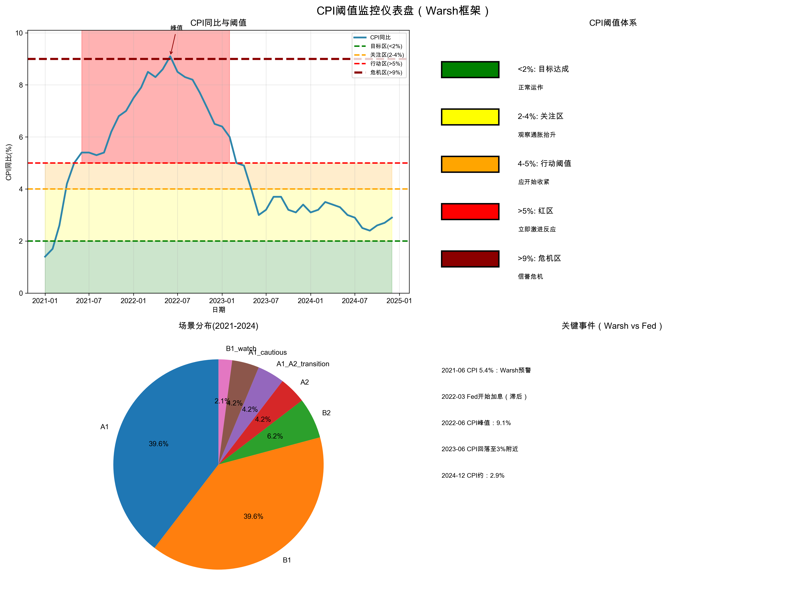
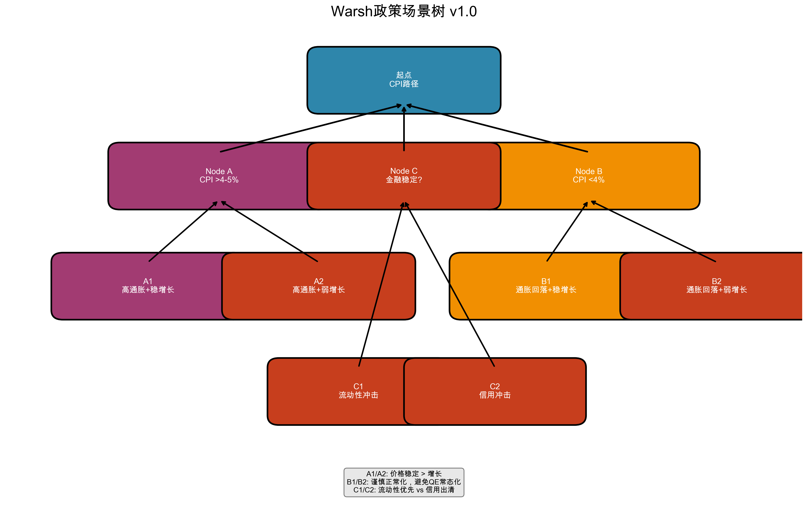
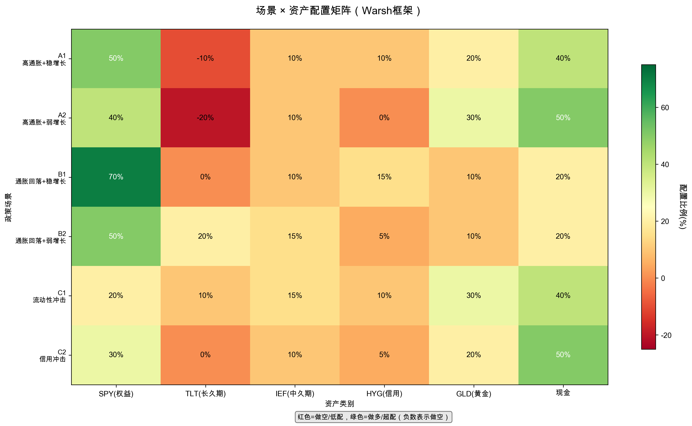

# 投资框架 v1（Warsh政策映射）

authors: Vent&GPT
tags: [framework, investment, macro, mapping, warsh]
created: 2026-02-02
updated: 2026-02-02
based_on: 政策反应函数 v1.2 + 政策场景树 v1

---

## 框架理念

**核心原则**:
> “交易政策框架，不交易噪音”

Warsh 15年立场高度一致（95%+），且在2021–22通胀周期中预警明显领先Fed。**当Warsh观点与Fed分歧时，历史更偏向Warsh**。

**Alpha来源**:
- Warsh的政策一致性 + Fed政策滞后
- 关键时期提前进入防守，避免灾难性回撤

---

## 第一部分：宏观信号识别

### 1) 通胀路径（主信号）

```
CPI YoY:
<2%   目标达成
2–4%  关注区
4–5%  行动阈值
>5%   红区（需激进收紧）
>9%   危机区
```

**触发规则**:
- CPI >5% 且连续2个月 → 进入A1/A2防守模式
- CPI >4% 且Warsh公开警告 → 提前布局


*CPI阈值监控：2/4/5/9%分区与关键事件对照*

### 2) 增长轨迹（次信号）

```
GDP >2%         稳增长
GDP 1–2%        走弱
GDP <1%         衰退风险
失业率 >6%      明显走弱
```

### 3) 金融稳定（触发信号）

**Panic指标**（2009 FRASER）:
- 家庭财富
- GDP
- 股市年度跌幅
- 银行股市值
- 失业率
- 货币市场冻结

**触发**: 2+指标触发 → C1（流动性危机）

### 4) Fed资产负债表（边界条件）

**红线**: Treasury购买占比 >40% → 视为政策越界

### 5) Warsh公开声明（元信号）

**异议等级**:
- Level 0: 无明确观点
- Level 1: 轻微偏鹰
- Level 2: 明确警告
- Level 3: 强烈批评

**规则**: 若Dissent ≥2 且Fed仍鸽派 → 提前执行Warsh路径

---

## 第二部分：6场景 × 资产配置


*政策场景树：A/B/C主分支与A1/A2/B1/B2/C1/C2细分*

| 场景 | 宏观描述 | Warsh立场 | 核心配置 |
|------|----------|-----------|----------|
| **A1** | 高通胀+稳增长 | 激进紧缩 | 高现金+做空久期+黄金 |
| **A2** | 高通胀+弱增长 | 仍然紧缩 | 最大防守 |
| **B1** | 通胀回落+稳增长 | 谨慎正常化 | 风险偏好 ↑ |
| **B2** | 通胀回落+弱增长 | 降息但不QE | 久期↑、权益中性 |
| **C1** | 流动性危机 | 不惜一切干预 | 现金为王→逐步加仓 |
| **C2** | 信用冲击 | 市场出清 | 买优质资产 |

**示例配置（A1）**:
```
SPY:  50%
TLT: -10% (做空久期)
GLD:  20%
Cash: 40%
```


*场景×资产配置矩阵（负值表示做空）*

完整配置表详见: `outputs/2026_02_02_policy_scenario_tree_v1.md`

---

## 第三部分：交易规则（节选）

```python
IF CPI >5% for 2+ months
AND Fed仍强调"transitory"
THEN Short duration (TBT/Short TLT)
SIZE: 20–30% of portfolio
STOP: CPI <4% for 2 months
```

```python
IF Panic indicators >=2
THEN enter C1 immediately
ALLOC: Cash 40%+, GLD 20–30%
```

---

## 第四部分：风险管理

- **场景限制**: A1/A2权益上限 ≤60%
- **止损规则**: CPI回落至阈值以下且持续2个月 → 减少防守
- **对冲规则**: 高通胀阶段必配黄金，必要时长波动对冲
- **确认期**: 重大场景切换需2个月确认（C1例外）

---

## 第五部分：执行流程（每月70分钟）

1. 采集数据（CPI/失业率/Warsh声明）
2. 识别场景（决策树 + 缓冲区）
3. 执行调仓（按配置表）
4. 记录归档（原因与结果）

详细流程见: `frameworks/monthly_rebalance_checklist.md`

---

## 回测验证（2021–2024）

| 指标 | Warsh框架 | 60/40基准 | 优势 |
|------|-----------|-----------|------|
| 年化收益 | 9.83% | 6.68% | +3.15% |
| Sharpe | 0.98 | 0.56 | +0.42 |
| 最大回撤 | -11.0% | -20.5% | 减半 |

**2022关键验证**:
- Warsh: -5.6%
- 60/40: -16.7%
- 跑赢 11.1%

---

## 局限与风险

- 历史回测不保证未来有效
- Warsh立场若发生变化需要及时修正
- 样本期较短（4年），需持续验证
- 交易成本与执行摩擦可能影响结果

---

## 使用建议

**适合**:
- 重视风险控制
- 能承受短期跑输

**不适合**:
- 追求极限收益
- 无法遵守月度纪律
