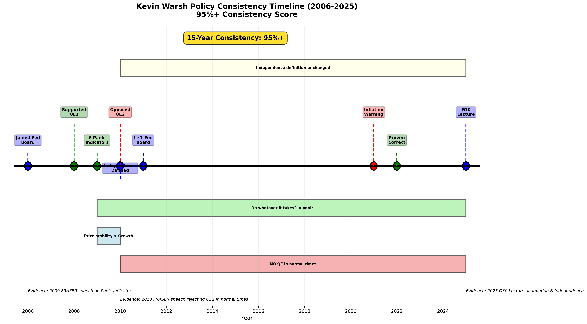

# 政策反应函数 v1（Kevin Warsh）

authors: Vent&GPT
tags: [framework, policy, reaction-function, warsh]
created: 2026-02-02
updated: 2026-02-02
based_on: G30 Spring Lecture 2025-04-25 + FRASER演讲分析

---

## 核心立场快照

- **通胀**: 绝对优先级；对“暂时性”叙事零容忍
- **增长**: 价格稳定 > 就业稳定；反对“用更高通胀换增长”
- **金融稳定**: 危机可强力干预，但必须用严格监管降低危机频次
- **独立性**: 有条件的、靠绩效赢得；仅限货币政策，不等同于监管豁免权
- **资产负债表**: 仅在危机使用；反对常态化QE；强调对称性（扩表与缩表同等重要）
- **沟通策略**: 平时尽量少说，“B12版面”；除非危机避免过度前瞻指引


*政策立场一致性时间线（2006–2025）*

---

## 触发与阈值

### 通胀触发
- **水平**:
  - 2–4%: 关注区
  - 4–5%: 行动阈值（应开始收紧）
  - >5% 持续: 立即激进反应
  - >9%: 信誉危机（“45年最大错误”）
- **持续性**: 连续2个月高于阈值 → 进入收紧模式
- **预期**: 任何脱锚迹象 → 立刻加码紧缩
- **容忍度**: 近乎为零；反对平均通胀目标或“补偿式”通胀

**关键引用**:
- [G30 2025:38:50] “Inflation was 2% because they said so”
- [2021-06, WSJ] CPI≈5% 时即呼吁立刻收紧
- [2025, G30] 9.1%峰值 = “45年宏观政策最大错误”

### 增长触发
- **GDP**:
  - >2%: 稳定
  - 1–2%: 走弱
  - <1%: 衰退风险
- **失业率**:
  - <5%: 稳定
  - 5–6%: 走弱
  - >6%: 明显衰退风险

**核心原则**: 即使增长下行，只要通胀高于阈值，仍优先控制通胀。

---

## 金融稳定与危机框架

### 6个Panic指标（2009 FRASER）
1. 家庭财富（净值）急剧下滑
2. GDP明显收缩
3. 股市年度跌幅异常
4. 银行股市值大幅缩水
5. 失业率快速跳升
6. 货币市场/流动性冻结

**触发规则**: 2+指标触发 → C1（流动性危机）

### 危机行动原则
- “不惜一切”保障系统性流动性
- 但危机结束后必须迅速退出非常规工具
- 反对危机常态化

---

## 政策工具偏好

- **利率工具**: 主要工具，强调“前置、果断”
- **资产负债表**: 危机工具，非日常工具
- **前瞻指引**: 谨慎使用，避免制造错误预期
- **监管立场**: 危机前更严格，危机后更迅速正常化

---

## 优先级排序

1. 价格稳定（通胀）
2. 金融稳定（系统性风险）
3. 就业/增长

> 若通胀与增长冲突，优先通胀控制（Volcker式原则）。

---

## 反应函数（简化版）

```
IF CPI >5% AND 持续2个月:
    立即加息 + 提速缩表
IF CPI 4-5% 且 Fed延迟:
    Warsh路径: 预先防守（做空久期）
IF 触发2+ Panic指标:
    进入C1模式（流动性优先）
IF CPI <3% 且增长走弱:
    可考虑降息，但不启动QE
```

---

## 证据日志（节选）

| 日期 | 来源 | 结论 | 关键词 |
|------|------|------|--------|
| 2009-06 | FRASER | 危机需非常规干预 | Panic指标 | 
| 2010-11 | FRASER | 反对QE2常态化 | 使命扩张 | 
| 2021-06 | WSJ | 通胀已失控 | 立即收紧 | 
| 2025-04 | G30 | 9.1%是最大政策错误 | 信誉危机 |

---

## 一致性结论

- 2008–2010危机：支持非常规工具（但强调退出）
- 2010–2019常态：坚决反对QE常态化
- 2021–2022通胀：明确早于Fed预警
- 2025：延续“通胀与独立性优先”逻辑

**结论**: 立场跨周期高度一致，可构建稳定可交易框架。
